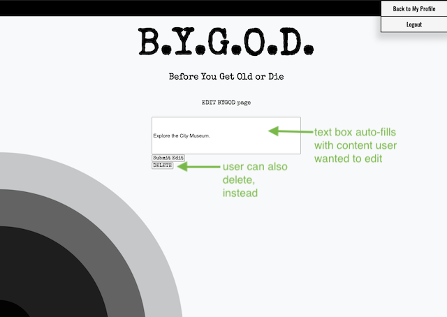

# B.Y.G.O.D.

Before You Get Old or Die (BYGOD) is an app to track the things you would like to do before you get old, or die, since you never know which will come first. 

## Motivation
This app aims to encourage people to live their life since none of us are guaranteed another day. No desire is too small, type it in and be reminded of it every time you log in. Be inspired by other people, inspire other people! Live your life!

## Version 1.0

## Screenshots

## Technologies Used
- CSS3
- HTML5
- JavaScript
- JSON
- EJS 
- Node.js
- MongoDB Atlas, cloud-hosted on AWS 
- Heroku (for deployment)

## Features
- Authentication via google-OAuth
   - Provides user authorization to  view full app features
- Ability to create list of BYGOD items on user profile.
- User can edit and delete their own BYGOD items as needed. 
- User can explore other user's profiles and their BYGOD items for inspiration.
- User can add BYGOD items from other profiles to their own profile.
- All user profiles display a profile picture and user-name, obtained from Google. 
- Navigation bar on the top right tells user what page they are currently on (highlighted in teal).

## Getting Started:
#### GitHub
https://github.com/eshoe2020/B.Y.G.O.D.
#### Trello
https://trello.com/b/xaASpmXR/bygod
#### Heroku - BYGOD app 
https://bygod.herokuapp.com/

## Stretch Goals
-Personalize the user profile page (My Profile) more:
   - Ability to put items into personalized lists.
   - Ability to sort items within lists, or on profile page, e.g. by date created.
   - Ability to search through items.
   - Ability to "mark off" (Strikethrough) when user completes an item.
   - Add a date/time stamp that user can make visible on their profile, to see when item was added.  

### Super-Stretch Goal
- Add in the ability to contact a fellow user if logged-in user want to collaborate on an item.
### Even Stretcher Goal
- Create an in-app communication method. 
